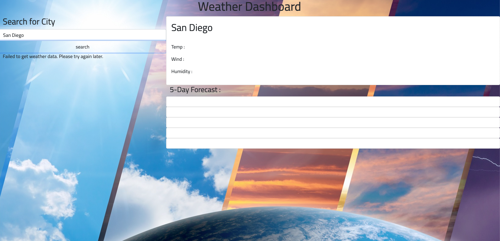

# Weather-Me

# Technology Used
HTML CSS JavaScript Jquery Git Hub

# Description 
The motivation behind this project was to make a webpage of current weather for anyone who was traveling to a new city or on vacation. The webpage is meant to pull up whatever city is typed into the search engine and provide the temp, wind, and humidity all while keeping the search history.

# Usage
Creating this weather site was meant to make it easier for clients to easilt pull up a location and see the temp. It would save all data of previously searched cities to easily navigate back through if needed.

# Portfolio
Learning points In this project I had a difficult time getting the API Key to properly work and had to change the javascript to properly function. I was able to get the cities to populate but had a difficult time getting the 

# License
N/A

Credits
"https://code.jquery.com/jquery-3.4.1.min.js" https://fonts.googleapis.com/css?family=Open+Sans&display=swap

https://fonts.googleapis.com/css2?family=Titillium+Web:ital,wght@0,400;0,700;1,200&display=swap

https://MomentJS.com/downloads/moment.js

https://cdn.jsdelivr.net/npm/bootstrap@5.1.3/dist/css/bootstrap.min.css"
  